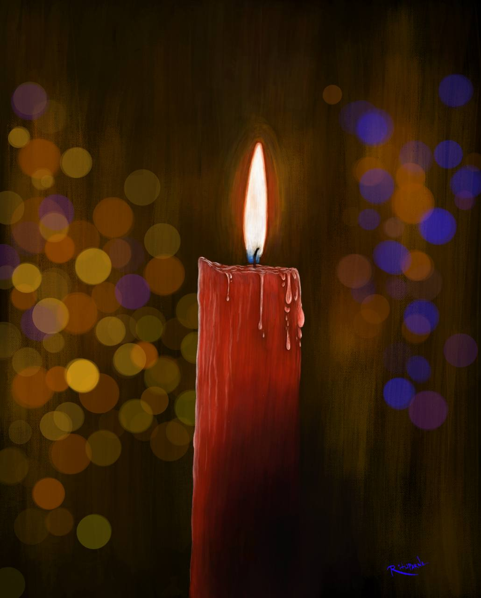
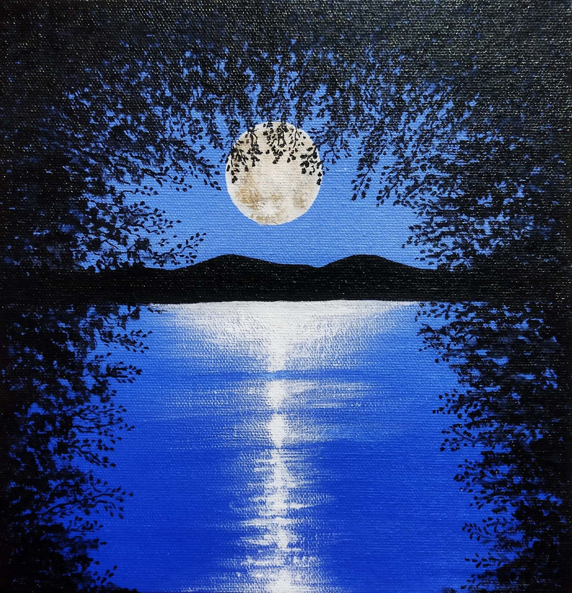
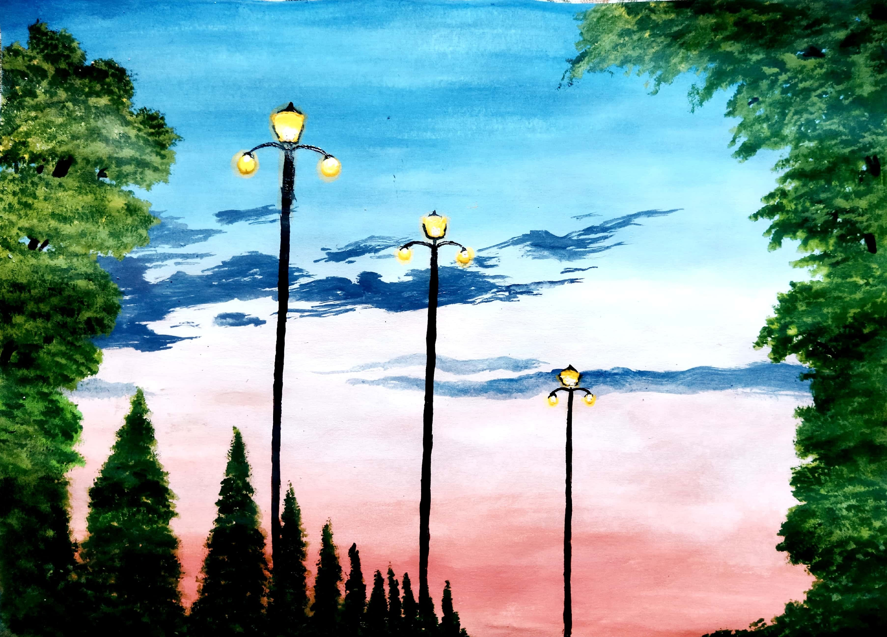
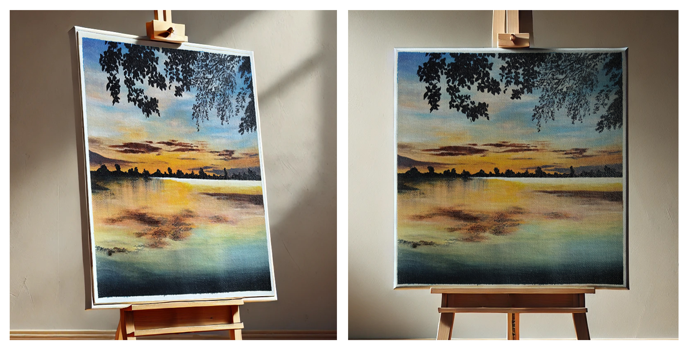

# My Art
The repository contains some of my paintings.

## 1. The Apricot Sky Above The Mystic Blue Mountains

It feels as though the setting sun bids farewell to the day, retreating beyond the azure hills to rest in the crimson embrace. The formless sky, painted with hues of milk and vermilion, crafts an ethereal canvus. Draped in the veil of twilight, the pine trees, too, lend their charm, exuding a serene splendor.

## 2. Amber Glow of Twilight With Pines Reflects on Calm Waters

A serene sunset graces the horizon, casting a golden glow over calm waters. Tall pine trees rame the scene, their silhouettes blending harmoniously with the tranquil sky. The reflection in the water mirrors nature's quit beauty, evoking a sense of peace and stillness.

## 3. Moonrise Above Scarlet River

A tranquil night scene. The bright full moonlight creates a soothing atmosphere against the deep violet background of the sky. The moon's glow reflects on the calm water, forming a silvery path. The silhouettes of tall trees on both sides add depth and natural beauty to the painting. The contrast between the bright moon and the dark elements enhances the painting's charm and captivating ambiance.

## 4. The Candle's Embrace Glowing in the Dark

The melting candle stands as if weeping silent tears, illuminating the darkness around. It embodies a subtle sense of melancholy, a quiet reflection of sorrow. The flame atop dances gracefully, steadfast yet alive, spreading the warmth of a serene glow, like a flicker of hope amidst the vast shadows. The surrounding blurred light paints a dreamlike realm, where faded memories seem to drift gently in the air. The candle’s steady radiance, juxtaposed with the soft, pulsating background, evokes an eternal beauty, touching the soul with a quiet intoxication of solitude and thought.

## 5. Snowman in Winter Glow

## 6. Withered Branches Along with the Feading Moon

## 7. Silent Shadows of Night

## 8. Azure Waterfalls Cascading Through Rocks in the Stilness of Nature

A vibrant depiction of nature, where the unmatched melody of its essence unfolds. A relentless stream flows from the slopes of a hill, creating waves as it cascades over rocks. The frothy cries of the waterfall seem to echo tales of untamed energy. In the distance, serene mountains stand silently, harmonizing with the violet-hued sky, guarding the spectacle with quiet dignity. The towering pine trees surrounding the scene, like steadfast sentinels, evoke a sense of nature’s stillness. This painting is not merely a reflection of a place but an ultimate experience of nature’s living music and poetic beauty.

## 9. Vermilion Sunset Behind Bare Branches CrimsonSky

## 10. Mystical Moonlit Night

## 11. Sunset Evening

## 12. Girl in Autumn Forest

## 13. Echoes of the golden hour 

This painting represents more than just a visual expression, it holds a fragment of my soul. 
The golden hues of the sky and the gentle ripples on the water reminded me of life’s balance, chaotic yet peaceful. 
Through this painting, I felt a deep connection with nature, which continues to inspire and heal me.

Read more about the painting in my article [Echoes of The Golden Hour](https://medium.com/@maineelite9/echoes-of-the-golden-hour-where-the-sky-embraces-the-water-930e412a3eab)

## 14. Hanging Basket of Flowers

## 15. Wolf Moon

! [WolfMoon](./Wolf-Moon.jpg)